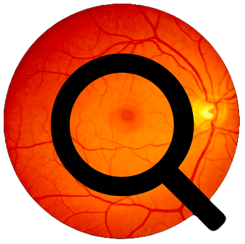
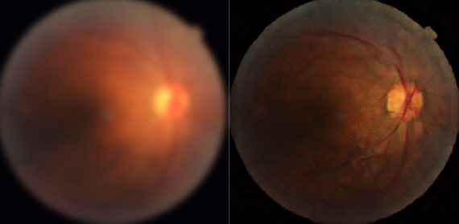
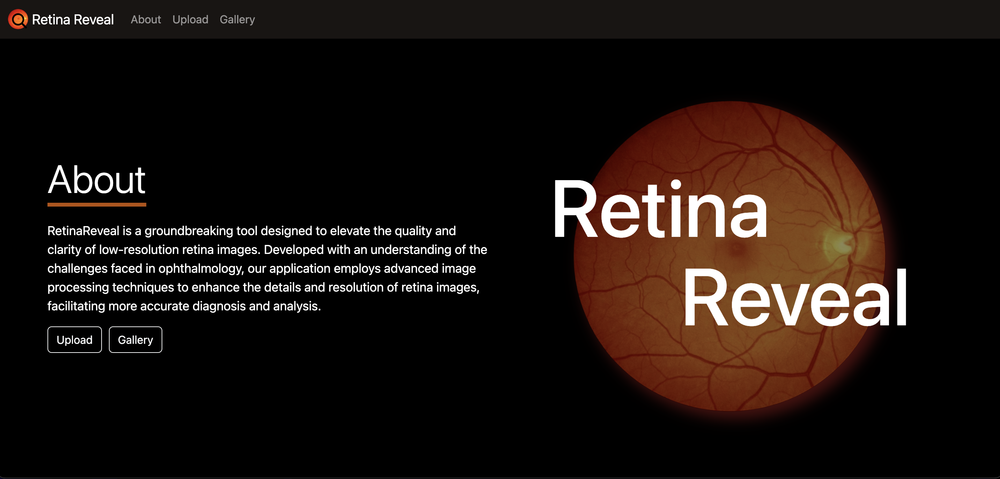

#  Retina Reveal

Retina-Reveal is a project developed at Penn's first Generative AI Hackathon. This application aims to enhance the quality of low-resolution retina images, thereby aiding in medical diagnosis and analysis. By employing a conditional GAN, the application transforms poor-quality retina images into higher-resolution versions, providing clearer details for medical professionals.

Given a blurry, underexposed or overexposed image, the model outputs a high quality version.

## Methodology
 - The [FIVES dataset](papers/DatasetPaper.pdf) provided sufficient and high quality images to be used for training. These images were then processed (code under processed folder) to yield 256x256 sized images.
 - Following the ([pix2pix framework](papers/Pix2PixPaper.pdf)) a U-Net generator and discriminator network were trained from scratch on a Google Cloud GPU with the Tensorflow backend (code under trainining folder).
 - A web application was developed using flask and native javascript so that non-technical users could use the model for image generation (code under app folder).

## Web Platform
To run the application, flask and tensorflow must be installed with pip. Run 'flask run' to start the application on a local server.

